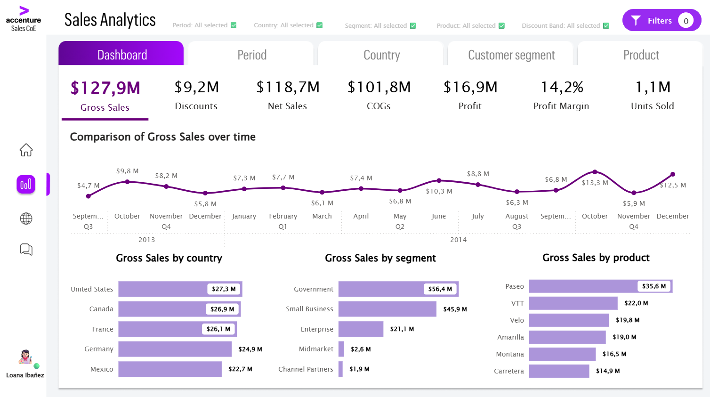

# 📊 Sales Analytics — Power BI Dashboard

A data visualization project developed as a professional assessment for an Accenture Data Visualization Specialist role. Built with a user-centered and business-centered methodology — articulating business questions, applying quantitative analysis, and working creatively and analytically to arrive at solutions using available data. From audience definition and needs analysis, through Figma wireframe and UI design, to a fully published Power BI dashboard.

## 📋 Executive Summary

This Sales Analytics dashboard reveals a consistent two-peak seasonal cycle, with significant revenue spikes in Q2 and Q4 driven by weather patterns and budget closures respectively. The United States leads regional performance with $27.3M in gross sales, while the Government segment dominates with 44% of total sales. Product-level analysis shows Paseo as the top performer across all periods. Notably, December 2014 recorded a 61% YoY growth, signaling a strong and expanding market opportunity worth prioritizing in future resource allocation.

## 🔗 Link

- 📌 [Live Dashboard](https://app.powerbi.com/view?r=eyJrIjoiZGJlMGY3MjYtMmIzNS00ZDg3LTlkOWQtZGM3ZWMzZWYwMjdiIiwidCI6IjEyYmMwNzYyLWZiOWEtNDFkNy1iODMyLWIzYWQ1OGE4YzRmOSIsImMiOjR9)

---

## 🎬 In Action

### KPI Overview & Insights Filter
The KPI cards act as button slicers — selecting any metric filters all charts on the page instantly.

### Slicer Pane
A responsive filter panel that opens like a mobile app, with a live filter status bar that signals when a filter is active.

### Navigation Pane
A sidebar navigation menu with icon-based tabs and tooltips to guide the user through the report.

### Tab Navigation — Period View
Dedicated tabs allow Sarah to drill into time-based, regional, segment, and product analysis.

### Personalize Visuals
Users can toggle between absolute and relative values using bookmarks and button states.

### Feedback Button
An embedded feedback mechanism so end users can share their experience directly from the report.

---

## 🗂️ Project Overview

This project involved designing and developing a **multi-tab Sales Analytics dashboard** in Power BI, using a publicly available sales dataset. The goal was to provide a mid-management executive with a powerful, intuitive tool to monitor business health and drive strategic decisions.

The process followed a structured methodology: define the audience, define the needs, define the solution, wireframe, build, and tell the story with data.

---

## 👤 The User

**Sarah** — Manager at Accenture's Sales Center of Excellence.

- Experienced Power BI user who needs **at-a-glance, high-level insights**
- Responsible for overseeing 5 regional programs
- Reviews reports monthly or quarterly
- Needs to act on **strategic planning and resource allocation**

---

## 🧭 Methodology

| Pillar | Description |
|---|---|
| **User-centered** | Easy to use, intuitive, and designed around Sarah's workflow |
| **Business-centered** | Directly solves business challenges with actionable insights |

---

## 🔄 Process

### Step 1 — Define the audience
Built a user persona to understand Sarah's context, goals, and level of expertise. This informed every design and technical decision that followed.

### Step 2 — Define the needs
Mapped must-have queries including profitability analysis, sales volume, regional performance, and segmented analysis by country, customer segment, and product.

### Step 3 — Define the solution
Designed a KPI card system that acts as a button slicer — allowing Sarah to filter all charts by selecting any metric. Combined with a responsive slicer pane and a tab navigation menu, this delivers a next-level analytical experience.

### Step 4 — Draw the wireframe
Started with pen and paper, then moved to **Figma** to create a polished layout following UX/UI principles: sidebar navigation, slicer pane, filter status bar, and consistent brand design.

### Step 5 — Get feedback
Feedback was gathered through an informal review with data analyst peers, who validated that the report needs and design direction would be met.

### Step 6 — Create the framework
ETL process and data modeling were performed in Power BI, including DAX calculations for all key measures.

### Step 7 — Plan the UI
UI choices were defined in Figma: colorblind-safe palette, Accenture monochromatic brand colors, Lucida Sans font, and rounded visual elements for a modern, clean look.

### Step 8 — Build the report
The report was built in Power BI following the Top 10 PBI UI strategies, with special focus on usability, accessibility, consistency, and engagement.

### Step 9 — Fine tune & test
The report was tested in PBI Service to ensure performance, correct filter behavior, and a smooth experience for end users.

### Step 10 — Publish
The report was published and is available as a live dashboard.

---

## 🛠️ Technical Highlights

- **ETL**: Created a unique `year_month` ID to group by country, product, segment and discount band. Calculated Gross Sales, Discounts, Net Sales, COGs, Profit, Profit Margin, and Units Sold.
- **DAX & Parameters**: Built a dynamic parameter with all measures and a selected measure to power the KPI button slicer.
- **Time Intelligence**: Used `PARALLELPERIOD` ([-1, QUARTER]) for quarter-over-quarter variance with tooltip integration.
- **UX/UI — Slicer Pane**: Designed a responsive filter panel with conditional formatting that signals when a filter is active (dark gray = all selected ✅, black = filtered).
- **UX/UI — Bookmarks & Buttons**: Used overlapping layers, bookmarks, and active/inactive button states for tab navigation and chart toggle (absolute vs. relative values).
- **Accessibility**: Applied a **colorblind-safe palette** and Accenture's monochromatic brand colors. Used Lucida Sans as a close match to Accenture's Graphik font.
- **Figma**: Designed tabs, sidebar icons, and layout components before building in Power BI.

---

## 📐 Dashboard Structure

| Tab | Focus |
|---|---|
| **Dashboard** | KPI overview + units sold by country, segment, and product |
| **Period** | Time-based analysis with quarterly variance and YoY comparison |
| **Country** | Regional performance breakdown |
| **Customer Segment** | Government vs. Enterprise vs. other segments |
| **Product** | Product-level sales trends (absolute and relative views) |

---

## 💡 Key Insights

- **Seasonality**: A consistent two-peak sales cycle with significant spikes in Q2 (April/June) and Q4 (October/December).
- **Top country**: United States led with $27.3M in gross sales.
- **Top product**: Paseo, followed by VTT.
- **Top segment**: Government accounted for 44% of total gross sales — the top three segments together represent ~95%.
- **USA December 2014**: 61% YoY growth, signaling a strong and growing market opportunity.
- **Government vs. Enterprise**: Government peaks at fiscal quarter-ends (June/September); Enterprise peaks at calendar year-end (December), driven by budget closures.

---

## 🧰 Tools Used

| Tool | Purpose |
|---|---|
| Power BI | Dashboard development, DAX, data modeling |
| Figma | Wireframing and UX/UI design |
| DAX | Measures, time intelligence, dynamic parameters |
| PowerPoint | Project storytelling and insights's communication |

---

## 📌 Executive Recommendations

1. **Capitalize on Q4 momentum** — Given the consistent Q4 spike, allocate additional budget and resources ahead of October to maximize the seasonal opportunity.
2. **Prioritize the Government segment** — With 44% of total sales, deepening relationships and expanding offerings within this segment represents the highest-impact growth lever.
3. **Invest in the US market** — The 61% YoY growth in December 2014 signals untapped potential; a targeted strategy for the US could accelerate overall revenue growth.

## ⚙️ Operational Recommendations

1. **Address the May and November dips** — The consistent low points within Q2 and Q4 suggest an opportunity to implement mid-quarter promotional campaigns to smooth revenue distribution.
2. **Review underperforming segments** — Channel Partners and Midmarket together represent less than 5% of sales; assess whether investment in these segments is justified or should be reallocated.
3. **Monitor Paseo dependency** — With Paseo consistently leading product sales, diversifying the top-performing product mix reduces business risk.

---

## ⚠️ Caveats & Assumptions

1. **Net Sales** — Assumed that Net Sales should be calculated from the Sales column, as the dataset did not explicitly define this relationship.
2. **Units Sold format** — Assumed Units Sold were whole numbers; all other measures were treated as currency represented in USD.
3. **Primary user** — Assumed the primary user is a mid-management sales executive with Power BI experience, based on the business context provided.
4. **Accessibility** — Assumed an inclusive work environment, which led to the choice of a colorblind-safe palette to cater to all user types.
5. **Profit Margin** — Added as an extra metric beyond the original requirements, assuming it would provide additional business value for strategic decision-making.
6. **KPI sort order** — Measures were sorted following the natural sales and profitability funnel: Gross Sales → Discounts → Net Sales → COGs → Profit → Profit Margin → Units Sold.

---

## 🔮 Future Improvements

1. **Optimize map visual** — The current map visual generates load delays and rendering issues; replacing it with a more performant alternative would improve the overall report experience.
2. **Forecast layer** — Add a sales projection for upcoming quarters using time intelligence functions, so Sarah can anticipate Q4 demand rather than only analyze it retrospectively.
3. **Mobile layout** — Design an optimized view for mobile devices, allowing Sarah to consult the dashboard on the go.
4. **Enhanced period analysis** — Replace or complement current time-based visuals with candlestick charts to better communicate volatility and range, add reference lines for targets or averages, and surface period-over-period variance directly on the visual without requiring tooltip interaction.

---

*Dataset: publicly available sales dataset. Developed as a professional assessment for an Accenture Data Visualization Specialist role.*
